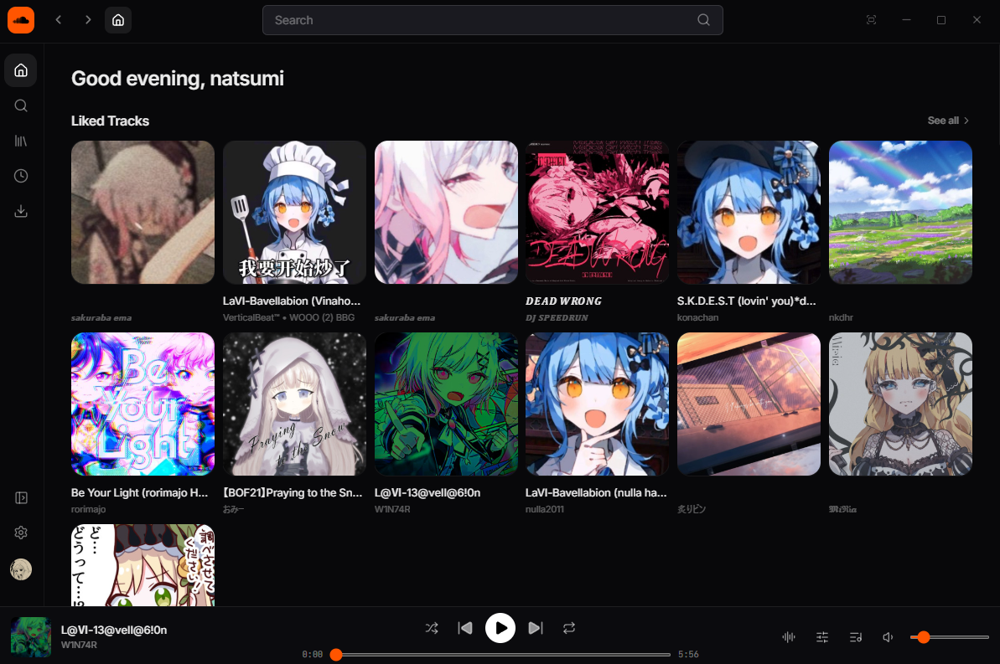
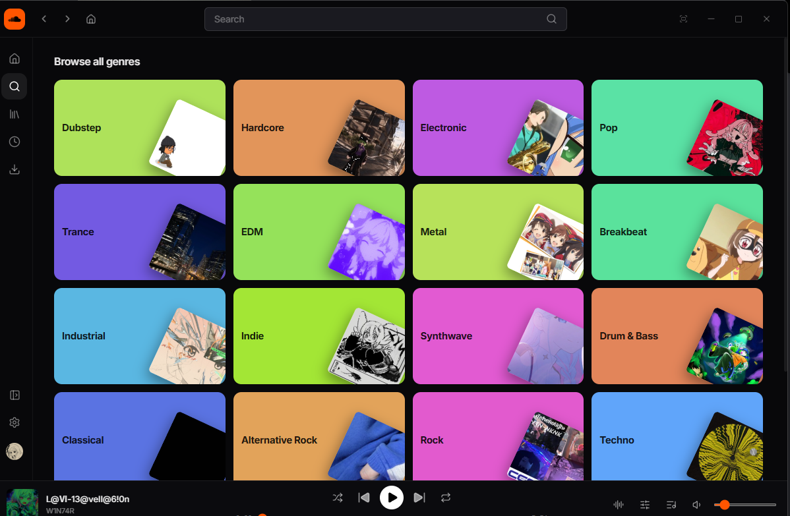
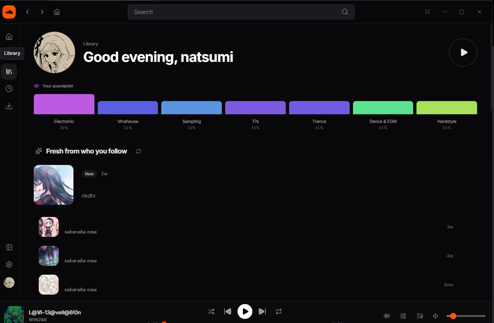
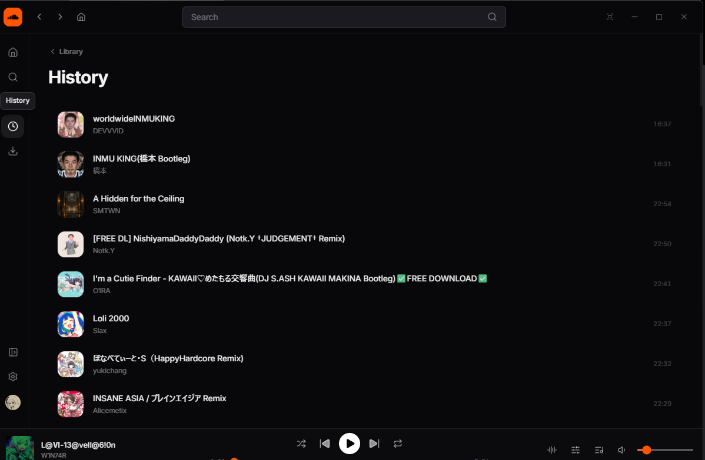
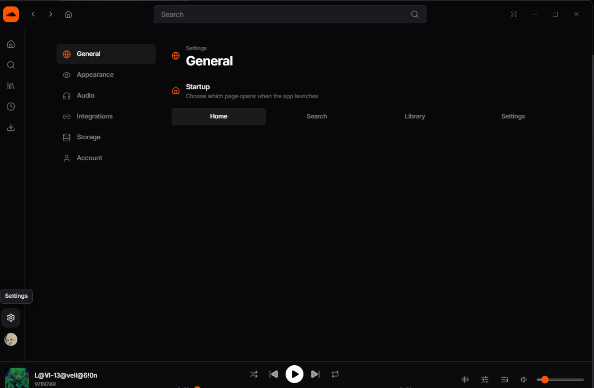
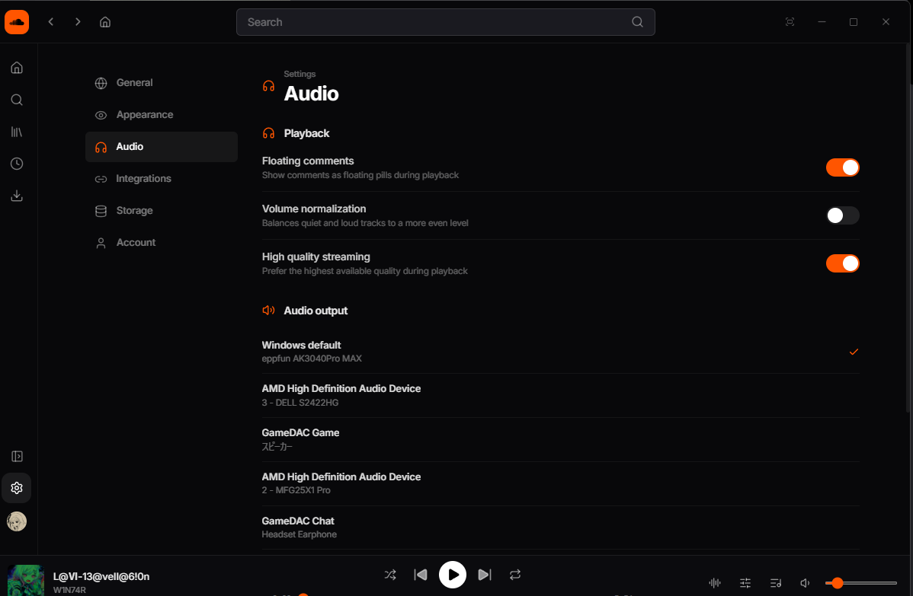

# SCD-Direct — Unofficial SoundCloud Desktop Client

> **Unofficial third-party SoundCloud desktop client.** This is a standalone,
> modified copy of [SoundCloud-Desktop](https://github.com/zxcloli666/SoundCloud-Desktop)
> by [@zxcloli666](https://github.com/zxcloli666), used under the MIT License.
> It is not affiliated with or endorsed by SoundCloud. All original credit belongs
> to the upstream project.
>
> **Intended for personal use only — provided as-is, at your own risk.** This is not
> a registered or authorized SoundCloud API client; it talks to SoundCloud the same
> way the web player does. Using it — including syncing your actions back to
> SoundCloud — is your own decision and may affect your account. See SoundCloud's
> [terms of use](https://soundcloud.com/terms-of-use). No warranty, no liability.

A backend-free **direct mode** build of this SoundCloud desktop app (Tauri v2 + React + Rust):
listen to SoundCloud on your desktop without a browser.
Instead of relying on the original developer backend (`api.scnative.space`), the app
talks to SoundCloud itself: search and playback go straight to the public api-v2, and
your actions (likes, follows, playlists, comments, history) are kept in a local store
and written back to SoundCloud where possible — see Limitations.

## Screenshots








## Features

- **Search** — tracks / playlists / users / albums via the public SoundCloud api-v2
  (`client_id` extracted from the SoundCloud homepage).
- **Playback** — streamed and cached directly from SoundCloud, no relay infrastructure.
- **Library** — liked tracks, playlists, followings and the following feed
  (read-only import from your SoundCloud account).
- **Browsing** — tracks, playlists, users, albums, comments (read).
- **Actions** — persisted in `direct_store.json` (app data dir); most are also written
  back to SoundCloud (see Limitations): like / unlike tracks and playlists, follow /
  unfollow users, create / edit / delete playlists, comments, playback history, dislikes.
- **Flat UI** — no gradients / glow / backdrop blur, compact artwork, Spotify-style
  playing indicator.

## Limitations

- Write actions are applied to the local store (`direct_store.json`) immediately and are
  **also written to soundcloud.com** through a hidden writer WebView
  (`src-tauri/src/direct/webview.rs`): the write runs as a `fetch()` on a real
  soundcloud.com page, so it carries the signed-in web session and passes DataDome.
  Synced: likes (tracks & playlists), follows, comments (post & delete), playlist
  creation, playlist track add / reorder / delete and play history.
  Local-only: playlist metadata edits, sharing toggles (playlist & track) and dislikes.
- If SoundCloud answers with a DataDome challenge, a verification window may open;
  the local state always stands (`direct:sync-error`).

## Differences from upstream

Backend-only features were removed together with the decorative layer:

- Discover catalog, Star / premium pages and pay flows
- SoundWave / recommendations / vibe search / clusters
- Aura palettes and decorative star fields (neutralised stubs remain so the API
  surface still compiles)
- Lyrics panel, Yandex Music import, QR session transfer, P2P call network,
  host-status banners
- Wallhaven online wallpaper search (custom image / URL wallpaper remains)
- Gradients, glow shadows, backdrop blur, decorative badges and the
  Fraunces / Unbounded display fonts (Inter + JetBrains Mono only)

## Signing in

Press "Sign in with SoundCloud" on the login screen: an in-app window opens
soundcloud.com, and once you sign in there, the session is picked up automatically
and stored locally in the app data directory (Rust session store). It is only ever
sent to SoundCloud.

## Build

Requirements (Windows): Rust (MSVC), VS Build Tools, CMake, NASM, LLVM (libclang),
Node 20+.

```sh
cd desktop
corepack pnpm install
corepack pnpm tauri dev     # development (Vite HMR)
corepack pnpm tauri build --bundles nsis   # release + NSIS installer
```

## Credits & License

Based on [zxcloli666/SoundCloud-Desktop](https://github.com/zxcloli666/SoundCloud-Desktop).
MIT License — see [LICENSE](LICENSE).

---

# SCD-Direct（日本語）— 非公式 SoundCloud デスクトップクライアント

> **非公式のサードパーティ製 SoundCloud デスクトップクライアントです。**
> 本リポジトリは
> [SoundCloud-Desktop](https://github.com/zxcloli666/SoundCloud-Desktop)
> （[@zxcloli666](https://github.com/zxcloli666) 氏、MIT ライセンス）を元にした
> 独立した改造版です。SoundCloud 公式とは無関係であり、公認も受けていません。
> オリジナルのクレジットはすべて上流プロジェクトに帰属します。
>
> **個人利用を目的とした非公式アプリです。現状のまま提供され、自己責任でのご利用となります。**
> 登録・認可された SoundCloud API クライアントではなく、Web プレイヤーと同様の方法で
> SoundCloud と通信します。利用（書き込みの同期を含む）はご自身の判断で行ってください —
> アカウントに影響が及ぶ可能性があります。詳細は SoundCloud の
> [利用規約](https://soundcloud.com/terms-of-use) を参照してください。無保証・責任を負いません。

開発元バックエンド（`api.scnative.space`）に依存しない **direct モード** ビルドの
SoundCloud デスクトップアプリです（Tauri v2 + React + Rust）。ブラウザなしで
SoundCloud を再生できます。検索・再生は公開 api-v2 に直接アクセスし、いいね・
フォロー・プレイリストなどの操作はローカルに保存したうえで、可能なものは
SoundCloud へも書き込まれます（制限事項参照）。

## スクリーンショット


## 機能

- **検索** — トラック / プレイリスト / ユーザー / アルバム（公開 api-v2、`client_id` は
  SoundCloud トップページから取得）
- **再生** — SoundCloud から直接ストリーミング＋キャッシュ（中継サーバー不要）
- **ライブラリ** — いいねしたトラック、プレイリスト、フォロー一覧、フォローフィード
  （SoundCloud アカウントからの読み取りインポート）
- **ページ閲覧** — トラック / プレイリスト / ユーザー / アルバム / コメント（読み取り）
- **操作**（`direct_store.json` に保存、多くは SoundCloud にも書き込み — 制限事項参照）—
  いいね/解除、フォロー/解除、プレイリスト作成・編集・削除、コメント、再生履歴、低評価
- **フラット UI** — グラデーション・グロー・ぼかしなし、コンパクトなサムネイル、
  Spotify 風の再生インジケーター

## 制限事項

- 書き込み操作はローカルストア（`direct_store.json`）に即時反映され、**同時に
  soundcloud.com にも書き込まれます**。実際の soundcloud.com ページ上で `fetch()` を
  実行する隠し writer WebView（`src-tauri/src/direct/webview.rs`）を使うため、
  サインイン済み Web セッションの指紋で DataDome を通過できます。
  同期対象: いいね（トラック / プレイリスト）、フォロー、コメント投稿・削除、
  プレイリスト作成、プレイリストへの曲追加 / 並べ替え / 削除、再生履歴。
  ローカルのみ: プレイリストのメタデータ編集、公開範囲切替（プレイリスト / トラック）、
  低評価。
- DataDome の挑戦（captcha）が返った場合は検証ウィンドウが開くことがあります。
  解決できない場合もローカルの状態は常に維持されます（`direct:sync-error`）。

## 上流からの変更（削除された機能）

- Discover カタログ、Star / プレミアムページ、課金フロー
- SoundWave / レコメンド / バイブ検索 / クラスタ
- Aura パレット、星の装飾（API 互換のためスタブは残存）
- 歌詞パネル、Yandex Music インポート、QR セッション移行、P2P 通話、
  ホスト状態バナー
- Wallhaven オンライン壁紙検索（画像 / URL 壁紙は残存）
- グラデーション、グロー、背景ぼかし、装飾バッジ、Fraunces / Unbounded フォント
  （Inter + JetBrains Mono のみ）

## サインイン

ログイン画面で「Sign in with SoundCloud」を押すと、アプリ内ウィンドウで
soundcloud.com が開きます。そこでサインインするとセッションが自動的に取得され、
アプリのデータディレクトリ（Rust セッションストア）にローカル保存されます。
SoundCloud 以外に送信されることはありません。

## ビルド

必要環境（Windows）: Rust (MSVC)、VS Build Tools、CMake、NASM、LLVM (libclang)、
Node 20+

```sh
cd desktop
corepack pnpm install
corepack pnpm tauri dev     # 開発（Vite HMR）
corepack pnpm tauri build --bundles nsis   # リリース＋NSISインストーラー
```

## クレジット / ライセンス

[zxcloli666/SoundCloud-Desktop](https://github.com/zxcloli666/SoundCloud-Desktop) を
元にしています。MIT ライセンス — [LICENSE](LICENSE) を参照。
